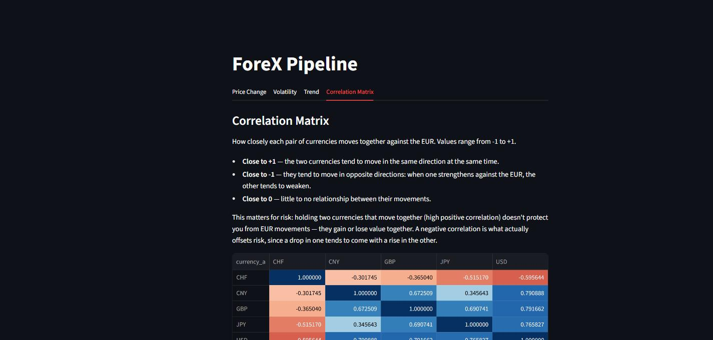

# FX-Pipeline

A daily currency exchange rate pipeline: fetches, cleans, stores, and serves ECB reference rates (EUR → USD, GBP, JPY, CHF, CNY) on an automated schedule — built to be safely re-runnable, not just to work once.



## Status

- [x] Extract, Transform, Load, Orchestrate — done, deployed to AWS RDS
- [x] Serve — running locally (Streamlit), 4 business-question views (price change, volatility, trend, correlation)
- [ ] Serve — deployed to Streamlit Community Cloud

## Stack

Python, pandas, psycopg2, APScheduler, PostgreSQL (AWS RDS), Streamlit, Docker.

## Run locally

```bash
git clone https://github.com/Hazzardbx/FX-Pipeline.git
cd FX-Pipeline
pip install -r requirements.txt
docker compose up -d          # or point .env at your own Postgres
python main.py                # runs the pipeline once, then starts the daily scheduler
cd serve
streamlit run app.py          # opens the dashboard at localhost:8501
```

Needs a `.env` with `POSTGRES_HOST`, `POSTGRES_DB`, `POSTGRES_USER`, `POSTGRES_PASSWORD`.

## Architecture

**Extract → Transform → Load → Orchestrate → Serve**

- **Extract** — pulls rates from the Frankfurter API (free, no key, wraps ECB reference rates), with retry and exponential backoff on server errors.
- **Transform** — type validation and null handling before anything touches the database.
- **Load** — upserts into Postgres using a composite primary key (`date, base, quote`), so re-runs are safe by design, not by accident.
- **Orchestrate** — APScheduler runs the job on weekdays at 17:00 CET (rates are only published once a day on business days, so anything more frequent would be pointless polling).
- **Serve** — a Streamlit app that's strictly read-only. It never calls the API and never writes to the database — that job belongs entirely to the scheduler.

## Why I built it this way

I came into the bootcamp from SAP ABAP development, so "does it actually run in production, on a schedule, without falling over" was never a hypothetical question for me — it's what six months of ticket work drilled in. I didn't want a project that only proves I can clean a CSV. I wanted one that proves I understand the difference between a script that works once and a pipeline that's safe to run 500 times.

That's why idempotency is the actual point of this project, not a checkbox. ECB rates don't change once published, so the backfill (from 2024-01-01) only needs to happen once — the daily job just adds one day at a time, and the upsert means a failed run, a double trigger, or catching up after downtime never duplicates a row.

The read-only Serve layer came out of a conversation with my instructor about what happens if multiple people hit the app at once and it fetched data on demand: race conditions, duplicate API calls, possible write conflicts. Splitting "who writes" (the scheduler) from "who reads" (the app) makes concurrent users a non-issue instead of something I'd have to engineer around with locks or queues.

## What's next

- Deploy the Streamlit app publicly (Streamlit Community Cloud)
- Cross-currency pairs (e.g. USD→CNY) via a SQL self-join — currently only EUR-based pairs are stored, everything else can be derived at query time
- A time-series model on the historical backfill: train on 2025, predict 2026, backtest against the real 2026 rates I already have — mostly to show I can do more than pipeline work
- A second API source as a fallback if Frankfurter goes down
- Splitting `main.py` into proper modules (`extract/`, `transform/`, `load/`, `orchestrate/`, `serve/` already exist as empty folders) — deliberately postponed until the core logic was working end-to-end, so I wasn't debugging both logic and file structure at once

## Note on branches

`master` is the clean version. `with-comments` is preserved as a snapshot of the working state before cleanup — decision log, dead ends, and all — if you want to see how the thing actually got built rather than the tidy final cut.
